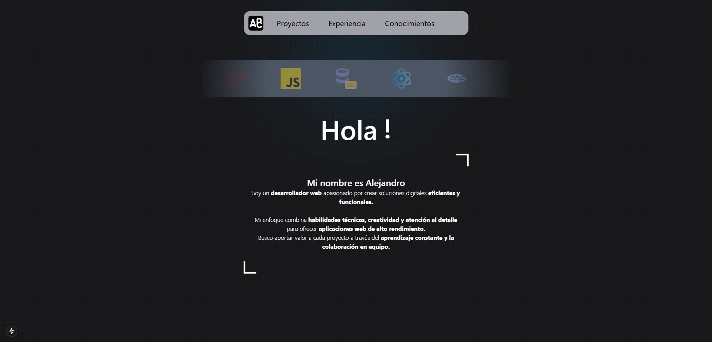

# Portfolio

Este es mi portafolio personal desarrollado con tecnologías modernas como **React**, **Tailwind CSS** y **Vite**. Incluye mis proyectos, información sobre mí y formas de contacto.

## 🚀 Tecnologías utilizadas

- [React](https://reactjs.org/)
- [Tailwind CSS](https://tailwindcss.com/)
- [Vite](https://vitejs.dev/)
- [JavaScript](https://developer.mozilla.org/en-US/docs/Web/JavaScript)
- [HTML5](https://developer.mozilla.org/en-US/docs/Web/Guide/HTML/HTML5)
- [CSS3](https://developer.mozilla.org/en-US/docs/Web/CSS)

## 📸 Captura



## 📁 Estructura del proyecto

portfolio/
├── public/
├── src/
│ ├── components/
│ ├── pages/
│ └── assets/
├── index.html
├── package.json
└── vite.config.js

## 📦 Instalación y uso

```bash
# Clonar el repositorio
git clone https://github.com/alecb6/portfolio.git

# Entrar al directorio
cd portfolio

# Instalar dependencias
npm install

# Ejecutar el servidor de desarrollo
npm run dev

Puedes contactarme a través de LinkedIn o alecb6@gmail.com.